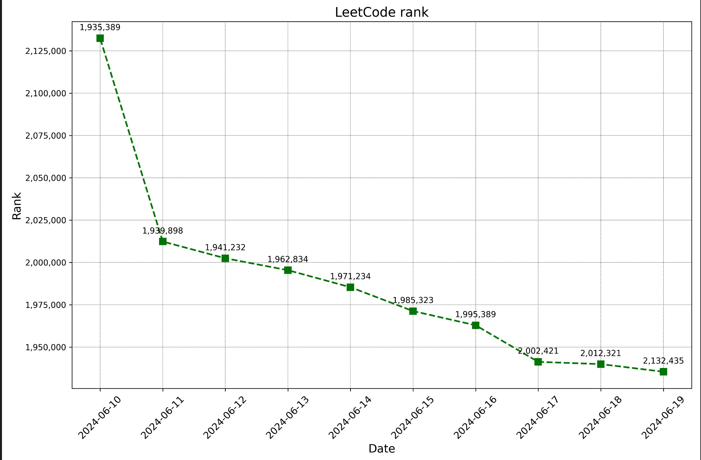

# LeetCode Rank Tracker

## :heavy_check_mark: Problem

  
- LeetCode only provides the current ranking.
- I wanted to see the changes in my rank over time.
<br></br>

## :heavy_check_mark: Solution
- A Python-based job and GitHub Actions are used as a scheduler to collect the LeetCode rank every hour.
- Based on the collected ranks, a graph image showing the rank changes is generated.

<br></br>

## :heavy_check_mark: How to Use
1. Fork this repository.
2. Edit the LeetCode username in `.github/workflows/scheduler.yml` to your own username.
    ```yaml
    - name: run job
      run: |
        python3 -m tracker --username {username}
    ```
3. Check the rank changes in the files `tracker/output/{username}.csv` and `tracker/output/{username}.png`.
```
date,rank
2024-06-10,2132435
2024-06-11,2012321
2024-06-12,2002421
2024-06-13,1995389
2024-06-14,1985323
2024-06-15,1971234
2024-06-16,1962834
2024-06-17,1941232
2024-06-18,1939898
2024-06-19,1935389
```
